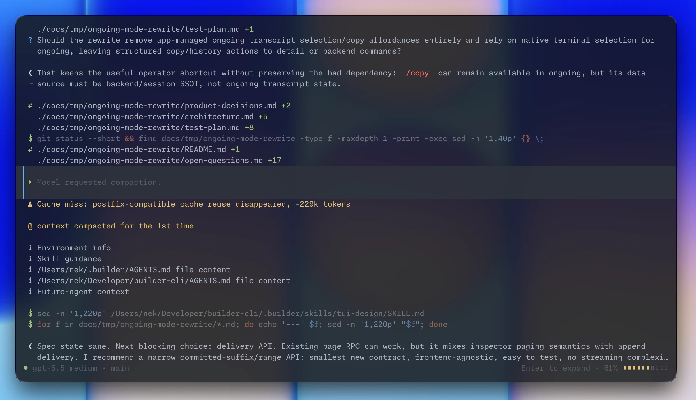

  

<h1 align="center">Builder</h1>

  <strong>Builder is a high-performance coding agent for professional Agentic Engineers focusing on output quality and long-running tasks.</strong>

  <a href="https://opensource.respawn.pro/builder/quickstart/">Quickstart</a>
  ·
  <a href="https://opensource.respawn.pro/builder/docs/">Docs</a>
  ·
  <a href="https://github.com/respawn-app/builder/releases">Releases</a>

Builder is a coding agent for professional engineers. It gives frontier coding models the features that empower them to produce their best output: from contextual reminders and harness awareness to token-optimized searches and async execution loops, then wraps that in a UI built for engineers who want to ship real products and work across multiple large codebases.

Codex and Claude Code are good defaults for quick demos and vibe-coding. Builder is for the moment you want the model to work freely but safely, for hours, on large codebases, as your pair programmer & collaborator.

Try it if you have ever lost work quality after compaction, watched an agent hide the command that mattered, babysat a long refactor with "continue" or ralph loops, fixed a hallucinated output, or yelled at the agent for missing test coverage.

  

## Why Builder

### Keeps going when the context gets hard

Compared to other harnesses, Builder has significantly higher compaction quality with its carryover prompts and a multi-step algorithm that **lets the model decide** when and what to compact.
The expensive failure is when model half-remembers a decision, forgets an in-flight edit, or restarts a plan after a bad summary. Builder is designed to make 35+ compactions survivable.

  

### Quality is first-class

- Builder teaches the model to **ask you questions** instead of bulldozing through changes to produce slop. Expect to make important product decisions, learn about caveats, perform refactoring, and ship high-quality code with Builder.
- Builder runs a **customizable supervisor agent** in parallel with the main agent. The supervisor reviews the agent's changes and steers it to follow instructions and do its best work.
- Subagents are real Builder runs, not obscure tool calls. The model delegates to **customizable agent roles, runs everything in async shells**, sleeps and wakes up in a natural, **0-token ralph loop** until the task is done, no matter the scope.

### Token-efficient & cheap

- Smart tool processing. Use **built-in shell optimizers** natively or **connect tools like `rtk`**, and unlike other popular coding agents, the model controls how the output is optimized.
- Unlike harnesses which overload models, Builder ships just **three tools** that enable the model to do everything: `patch`, `shell`, and `ask`. Everything else is smart, contextual, composable, non-blocking.
- Efficient shells. **Tools run async** with the main model: no timeouts, no retries, and compact file-based inspection of shell outputs lead to **1.6-2x token savings**.
- Cache invalidation tracking. Unlike some harnesses that drain your limits in minutes due to a caching bug, with Builder **you know about every unwanted cache miss**. Not that they will happen, with Builder's **lock-based cache preservation** mechanisms.
- **Shell-native, scriptable search/read stack** with optimized `rg` config enables **40% more efficient searches** instead of clunky Search, Glob, Grep, Read, Scroll chains.

### Everything is customizable & transparent

- Unlike popular harnesses, Builder supports customizing **subagent roles**, **compaction algorithms**, web search, supervisor and main model **system prompts**, skills, tools, reminders, caching, and more. 
- With local overrides of everything, create **per-project system prompts**, skill bundles, subagent roles and share the setup with your team via a single `.toml` file.
- The default UI is **fast, non-flickering, native transcript**. Unlike some providers, Builder's detailed mode lets you **inspect every input and output** so there's no surprises, ever.

### True Sandboxing & Parallelization

- Builder runs a single 50mb **server process that orchestrates all your agents** & shells. Unlike other harnesses which embed an unreliable custom sandbox, you can run Builder **completely isolated** (e.g. via Docker) and connect to it from your favorite terminal - no SSH, no tmux.
- Git worktrees are first-class. Run 10+ agents in parallel via **auto-managed worktrees with customizable setup logic**. Unlike other harnesses, the agent knows how to handle the worktree and won't break your repo.

  

## Where Builder Stands Out

| Area | Builder's bet |
| --- | --- |
| Visibility | Exact commands, patches, background shells, detail hydration, and reviewer output are inspectable instead of reduced to vague activity labels. |
| Long sessions | Local and native compaction, proactive handoffs, pre-submit compaction, queued prompts across compacts, and full persisted history are designed for multi-hour work. |
| Output quality | A supervisor pass and native review workflow put a second agent on the code while the original run still has context to repair mistakes. |
| Parallel work | Headless `builder run` roles and background shells make subagents scriptable, interactive, resumable, and visible. |
| Repo reality | Multi-repo projects, worktrees, shared shells, and a global server keep the agent attached to the checkout you mean. |
| Model burden | Builder keeps the model-facing tool surface small and moves reliability into deterministic runtime behavior instead of prompt bloat. |
| Control | System prompts, reviewer prompts, skills, slash commands, command post-processing, model settings, and provider capability overrides are local files, not hidden product state. |

## What Is Included

Builder covers the core coding-agent loop and the surrounding engineering workflow:

- Terminal UI with ongoing mode, detail mode, native scrollback, markdown rendering, syntax highlighting, real input cursor behavior, prompt history, message editing, session forks, and system notifications.
- Model tools for shell execution, background process interaction, patch editing, interactive questions, local image/PDF viewing, and native web search.
- OpenAI/Codex subscription OAuth, OpenAI API-key auth, OpenAI-compatible base URL support (including local models), model reasoning/verbosity settings, `/fast` mode.
- Local and workspace `AGENTS.md`, system prompt files (`SYSTEM.md`), reviewer prompt overrides, skills, built-in slash commands, and file-backed custom prompts.
- Session listing, project/workspace metadata, local server mode, system background service, multi-client connectivity, resumable headless runs, and structured JSON output for automation.
- Smart, proactive compaction or provider-native compact endpoints, context-budget tracking, cache warning policy, and queue preservation across compaction.
- Git worktree create/switch/delete flows with management UI, setup scripts, and agent context awareness.
- Command output shaping through built-in shell post-processing or a local JSON hook, with raw output still available when the model needs it.

## Philosophy

Builder is intentionally narrow. It optimizes for engineers who want a strong model, collaborative workflows, and great outputs. 
The model stays unburdened; the harness should provide infrastructure around it. As such, there will not be:

- MCP support; MCP is outdated, use `mcporter` or migrate to CLIs.
- Plan mode; just prompt the model to plan with you, there's no need to handicap it.
- WebFetch tool; teach the agent to use [r.jina.ai](jina.ai/reader), browser control CLI, or curl.

## Why no Anthropic/Gemini model support?

- Anthropic and Gemini disallow use of third-party harnesses with subscriptions. Using them can get you banned, asking for their support will get people behind Builder sued. Please do not ask for support here.
- Using models with API keys can be supported, but the priority is low due to high costs and significant effort to optimize the harness for models. Please create or upvote an issue if you want to use Builder with an API key. Builder already supports OpenAI Responses-compatible APIs.

## License

Builder is licensed under `AGPL-3.0-only`. See [LICENSE](./LICENSE).
