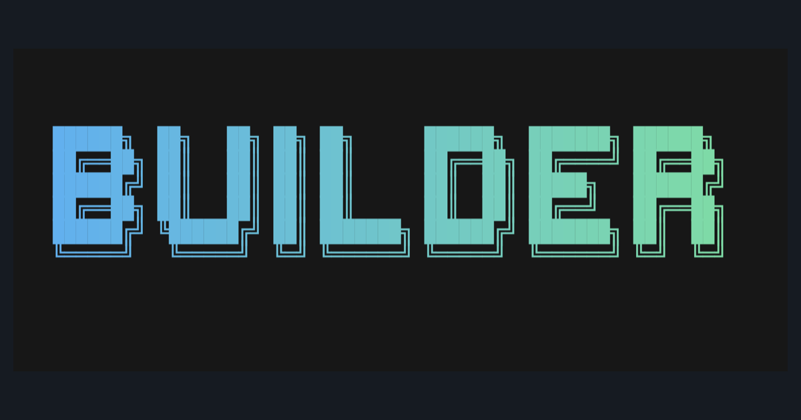

<p align="center">
  
</p>

Builder is a highly opinionated terminal coding agent for professional Agentic Engineers, focusing on output quality. 

## Get started 

Everything you need is in the [Quickstart Guide](https://opensource.respawn.pro/builder/quickstart) - start there.

### Features:

- [x] Agentic loop with `shell`, `ask_question`, `patch` tools.
- [x] Native local image/PDF attachment tool (`view_image`) for path-based multimodal reading.
- [x] Explicit clipboard screenshot paste hotkeys (`Ctrl+V`, `Ctrl+D`) that insert temp image paths into the prompt.
- [x] Support for Codex login and OpenAI api keys.
- [x] Compaction, including auto, using native Codex/OpenAI endpoints, or our own custom prompt.
- [x] Compact UI mode for ongoing work, and detailed mode to review thinking, tool calls, prompts, summaries.
- [x] Queueing messages, steering the model (Tab to queue, Enter to steer)
- [x] Asking interactive questions
- [x] Terminal and system notifications for asks/approvals and turn completion
- [x] Config file with model selection, tool config, compact threshold, timeouts.
- [x] Local and global `AGENTS.md` support
- [x] Session and history persistence and resumption
- [x] Markdown rendering
- [x] Saved prompts
- [x] Syntax highlighting
- [x] Native Web search (for now only OpenAI)
- [x] Calling shell directly via `$`
- [x] Premade prompts for review, compaction, init.
- [x] Esc-esc-style editing of messages and history rewrites
- [x] Agent skills support
- [x] Background shells, which enable subagents via headless mode: `builder run`
- [x] Model verbosity for openai models
- [x] Native terminal scrollback, selection, copy-paste
- [x] `/fast` mode
- [x] Native code review

### What will likely never be implemented

These features are controversial or questionable for model performance, and usually have a better replacement. Here is where this project has to be opinionated:

- Native subagent orchestration inside one process; use separate headless Builder instances instead.
  - Supported path: `builder run "..."` for tmux/background subagent workflows. Agent already does this on its own.
- Plan mode - the model has native plan capabilities and can always ask questions, rest is just eye candy.
- MCPs - mcps are net negative on model performance, pollute context, and can be replaced with CLI scripts. MCPs can be turned into CLIs easily with tools like [MCPorter](https://github.com/steipete/mcporter)
- Extra UI candy tool calls. Less tools, less burden on the model.
- On the fly changing of toolsets or models. Changing models at runtime hurts model performance and invalidates caches, which can cost up to 10x more per invalidation.
- Microcompaction - this invalidates caches and drives costs up with marginal benefits
- Sandboxing - Codex's sandbox is annoying, doesn't work with many tools (gradle, java etc), junie's sandbox can be bypassed, claude code's sandbox is brittle and can also be bypassed. Builder can be easily sandboxed in a true, fully isolated Docker container with remote connection (no ssh hacks).
- WebFetch tool or similar. Just use [jina.ai](https://r.jina.ai) to fetch urls.
- Fancy summaries, UI, minimal mode, features for "vibe coding". The philosophy is to build something for professionals (agentic engineers).
- Anthropic, Gemini, Antigravity subscription usage. Not until that becomes legal according to those companies' ToS.

## License

Builder is licensed under `AGPL-3.0-only`. See `LICENSE`.

```
IN NO EVENT UNLESS REQUIRED BY APPLICABLE LAW OR AGREED TO IN WRITING
WILL ANY COPYRIGHT HOLDER, OR ANY OTHER PARTY WHO MODIFIES AND/OR CONVEYS
THE PROGRAM AS PERMITTED ABOVE, BE LIABLE TO YOU FOR DAMAGES, INCLUDING ANY
GENERAL, SPECIAL, INCIDENTAL OR CONSEQUENTIAL DAMAGES ARISING OUT OF THE
USE OR INABILITY TO USE THE PROGRAM (INCLUDING BUT NOT LIMITED TO LOSS OF
DATA OR DATA BEING RENDERED INACCURATE OR LOSSES SUSTAINED BY YOU OR THIRD
PARTIES OR A FAILURE OF THE PROGRAM TO OPERATE WITH ANY OTHER PROGRAMS),
EVEN IF SUCH HOLDER OR OTHER PARTY HAS BEEN ADVISED OF THE POSSIBILITY OF
SUCH DAMAGES.
```
